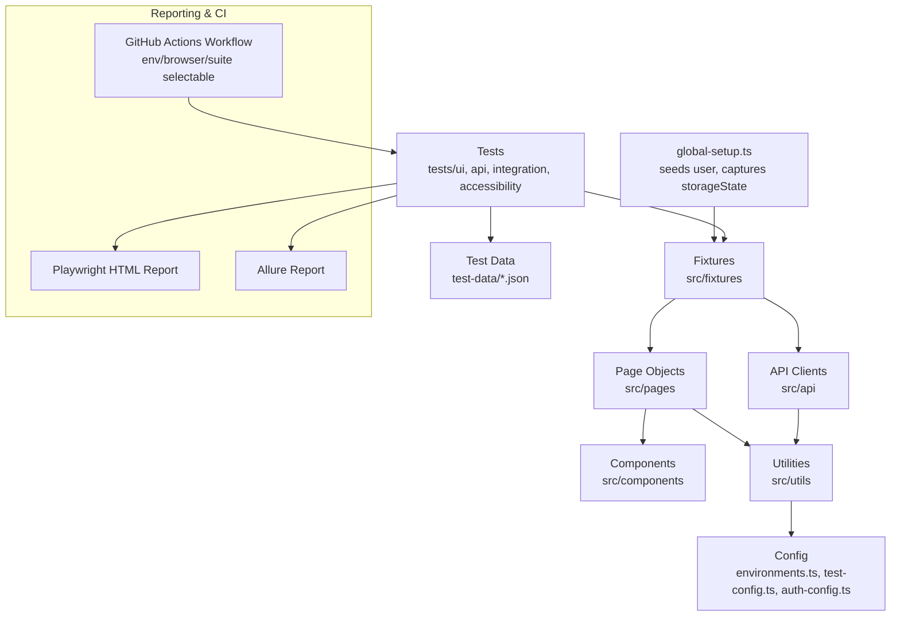

# Playwright SDET Automation Framework

[](https://nodejs.org/)
[](https://playwright.dev/)
[](https://www.typescriptlang.org/)
[](.github/workflows/playwright-tests.yml)
[](LICENSE)

An enterprise-style UI and API test automation framework built with Playwright and TypeScript. It demonstrates how a scalable automation suite is structured for a real engineering organization: layered architecture, Page Object Model, reusable fixtures, typed API clients, environment-based configuration, cross-browser and parallel execution, and CI/CD with Allure and HTML reporting.

---

## Overview

This repository automates both the UI and API layers of a public e-commerce demo application, [automationexercise.com](https://www.automationexercise.com), which exposes a browsable storefront and a documented REST API. It was built to reflect the design decisions and practices used in production-grade quality engineering teams rather than a single-file tutorial script.

The framework covers account creation and login, product search and cart management, checkout, REST API contract validation, UI-to-API state consistency, and automated accessibility checks — with positive, negative, and boundary test coverage throughout.

---

## Key Capabilities

- Page Object Model with a shared base page and composable UI components
- Typed API client layer for REST request/response validation
- Reusable Playwright fixtures: authenticated session, static test data, API clients, and environment config, all injected via dependency injection
- `storageState`-based authentication with a `global-setup.ts` that logs in once — no test repeats the login UI as a side effect of an unrelated flow
- Environment-based configuration for local, QA, and staging targets
- Dynamic test data generation with unique, collision-free values per run, plus static JSON fixtures for boundary/invalid cases
- Six-tag test classification (`@smoke`, `@regression`, `@api`, `@ui`, `@integration`, `@critical`) using Playwright's native tag API
- Cross-browser execution across Chromium, Firefox, and WebKit
- Fully parallel test execution with configurable worker counts
- Automatic retries in CI to absorb transient network flake
- Trace, screenshot, and video capture on test failure
- Allure and Playwright HTML reporting, enriched with environment/CI metadata
- A single, parameterized GitHub Actions workflow (environment/browser/suite selectable) with matrixed browser execution and artifact publishing
- Automated accessibility checks (WCAG 2.1 A/AA) via axe-core
- Documented `test.skip` / `test.fixme` usage — scenarios with no corresponding app behavior stay visible in the suite instead of being silently deleted

---

## Technology Stack

| Category | Technology |
|---|---|
| Test runner | Playwright Test |
| Language | TypeScript (strict mode) |
| Runtime | Node.js 18+ |
| API testing | Playwright `APIRequestContext` |
| Reporting | Allure Report, Playwright HTML Reporter |
| Accessibility | `@axe-core/playwright` |
| Test data generation | `@faker-js/faker` |
| Logging | Winston |
| CI/CD | GitHub Actions |
| Linting/formatting | ESLint, Prettier |

---

## Architecture



Tests depend only on fixtures and page/API objects — never on raw locators or HTTP calls directly — so UI or API changes are isolated to a single file rather than rippling across the suite.

---

## Repository Structure

```
playwright-sdet-automation-framework/
├── .github/workflows/
│   ├── playwright-tests.yml                 Consolidated CI pipeline (smoke/regression/ui/api/all)
│   └── regression.yml                       Deprecated — see the notice inside the file
├── config/
│   ├── environments.ts                      Base URLs per environment (local/qa/staging)
│   ├── test-config.ts                       Retries, timeouts, worker/execution settings
│   └── auth-config.ts                       Seeded user + storageState path, shared by global-setup
├── global-setup.ts                          Logs in once, captures storageState, writes Allure env info
├── src/
│   ├── api/                                 Typed REST client + resource API classes
│   ├── pages/                               Page Object Model classes (login, dashboard, products,
│   │                                          product details, cart, checkout)
│   ├── components/                          Reusable UI fragments (e.g. navigation)
│   ├── fixtures/                            Extended Playwright test fixtures
│   ├── utils/                               Logger, test data generator, env helper
│   └── types/                               Shared TypeScript domain types
├── tests/
│   ├── ui/                                  UI scenarios: login, search, filter, product details,
│   │                                          cart, checkout
│   ├── api/                                 API contract tests (products, users)
│   ├── integration/                         UI ↔ API consistency tests
│   └── accessibility/                       Automated WCAG checks
├── test-data/                               Static boundary/invalid test data (users, products, cart)
├── docs/                                    Architecture, test strategy, CI/CD, traceability matrix
├── playwright.config.ts
├── package.json
├── tsconfig.json
└── README.md
```

---

## Framework Design Principles

- **Separation of concerns** — tests express intent; page objects and API classes handle implementation detail
- **Composition over inheritance** — shared UI fragments (navigation) are composed into pages rather than duplicated
- **Single responsibility** — one API wrapper class per resource, one page object per screen
- **Type safety** — strict TypeScript with explicit interfaces for all domain models
- **DRY authentication** — a single seeded session is logged in once via `global-setup.ts` and reused via `storageState`, not re-built through the UI in every test that merely needs to be logged in
- **Resilient locators** — role, label, placeholder, and `data-qa` based locators over brittle CSS selectors
- **No hard-coded waits** — relies on Playwright's built-in auto-waiting and explicit assertions
- **Environment portability** — no environment-specific values hard-coded into test logic

---

## Prerequisites

- Node.js 18 or later
- npm 9 or later
- Git

---

## Installation

```bash
git clone <repo-url>
cd playwright-sdet-automation-framework
npm ci
npx playwright install --with-deps
```

---

## Environment Configuration

```bash
cp .env.example .env
```

| Variable | Purpose |
|---|---|
| `ENV` | Target environment: `local`, `qa`, or `staging` |
| `BASE_URL` / `API_BASE_URL` | Optional overrides for QA/staging targets |
| `HEADLESS` | Run browsers headless (`true`/`false`) |
| `WORKERS` | Parallel worker count |
| `RETRIES` | Retry attempts on failure |
| `LOG_LEVEL` | Winston log verbosity |
| `SEED_USER_NAME` / `SEED_USER_EMAIL` / `SEED_USER_PASSWORD` | Credentials for the seeded account `global-setup.ts` logs in as to capture `storageState` |

Environment resolution is centralized in `config/environments.ts`; execution behavior (timeouts, retries) is centralized in `config/test-config.ts`; the seeded storageState account is centralized in `config/auth-config.ts`.

---

## Available npm Commands

| Command | Description |
|---|---|
| `npm test` | Run the full suite across all browser projects |
| `npm run test:smoke` | Run `@smoke`-tagged tests |
| `npm run test:regression` | Run `@regression`-tagged tests |
| `npm run test:ui` | Run UI tests only |
| `npm run test:api` | Run API tests only |
| `npm run test:integration` | Run UI ↔ API integration tests |
| `npm run test:accessibility` | Run accessibility checks |
| `npm run test:headed` | Run tests in headed (visible browser) mode |
| `npm run test:debug` | Run tests with the Playwright Inspector |
| `npm run test:chromium` / `firefox` / `webkit` | Run against a single browser engine |
| `npm run test:qa` / `test:staging` | Run against a specific environment |
| `npm run report:html` | Open the Playwright HTML report |
| `npm run report` | Generate and open the Allure report |
| `npm run typecheck` | Run TypeScript in `--noEmit` mode |
| `npm run lint` / `lint:fix` | Lint (and auto-fix) the codebase |
| `npm run format` | Format the codebase with Prettier |

---

## How to Execute Tests

**All tests**
```bash
npm test
```

**UI tests**
```bash
npm run test:ui
```

**API tests**
```bash
npm run test:api
```

**Smoke tests**
```bash
npm run test:smoke
```

**Regression tests**
```bash
npm run test:regression
```

**Headed mode**
```bash
npm run test:headed
```

**Debug mode**
```bash
npm run test:debug
```

**A single test file**
```bash
npx playwright test tests/ui/login.spec.ts
```

**A single test by name**
```bash
npx playwright test -g "login fails with incorrect credentials"
```

---

## Cross-Browser Execution

The suite is configured to run against Chromium, Firefox, and WebKit via Playwright projects in `playwright.config.ts`, with `fullyParallel: true` for concurrent execution within and across browsers.

```bash
npm run test:chromium
npm run test:firefox
npm run test:webkit
```

---

## Test Reporting

- **Playwright HTML Report** — generated on every run, viewable with `npm run report:html`
- **Allure Report** — generated from `allure-results/`, viewable with `npm run report`
- **Failure artifacts** — traces, screenshots, and videos are captured automatically on failure (`trace: on-first-retry`, `screenshot: only-on-failure`, `video: retain-on-failure`)

```bash
npx playwright show-trace test-results/<test-name>/trace.zip
```

---

## CI/CD — GitHub Actions

`.github/workflows/playwright-tests.yml` is a single, parameterized pipeline:

- **push**/**pull_request** to `main` → fast `@smoke` run, single browser
- **nightly schedule** → full `@regression` run, all three browsers
- **workflow_dispatch** → manual run with three inputs: **environment** (`qa`/`staging`),
  **browser** (`chromium`/`firefox`/`webkit`/`all`), **suite** (`smoke`/`regression`/`ui`/`api`/`all`)

Each run: checks out the repo, installs dependencies (`npm ci`) with npm caching, installs
only the Playwright browser(s) it needs, runs ESLint and `tsc --noEmit`, executes the
resolved test selection, generates the Allure report, and uploads the Playwright HTML
report, Allure report, and `test-results/` (traces, screenshots, videos) — every upload
step runs with `if: always()`, so a failed run is fully debuggable without re-running
locally. Retries (`RETRIES=2`) and worker count (`PLAYWRIGHT_WORKERS` repo variable,
default 2) are both configurable without editing the workflow.

`.github/workflows/regression.yml` is kept in the repo as a documented, inert file — it was
the original separate regression workflow before consolidation; see the comment at the top
of that file for why and how to revert if you'd prefer physically separate workflow files.

See [`docs/ci-cd.md`](docs/ci-cd.md) for the full pipeline breakdown.

---

## Test Strategy

- **API tests** carry the majority of business-logic coverage — fast and stable
- **Integration tests** confirm the UI and API agree on shared state (e.g. an account created via API can log in through the UI, or a cart price matches the API-reported price)
- **UI tests** cover critical, end-to-end user journeys: login/signup, product search, category/brand filtering, product details, cart add/update/remove, checkout validation, and order confirmation
- **Accessibility tests** provide an automated WCAG 2.1 A/AA baseline on key pages
- Every functional area includes **positive, negative, and boundary/validation** scenarios
- Tests carry one or more of six tags via Playwright's native tag API: `@smoke`, `@regression`, `@api`, `@ui`, `@integration`, `@critical`
- Two scenarios are documented as `test.skip`/`test.fixme` (payment Luhn validation, single-product-by-ID API lookup) because the demo app has no corresponding behavior to test — each has an inline comment explaining why, and both stay visible in every report run

Full details in [`docs/test-strategy.md`](docs/test-strategy.md); a complete test-by-test breakdown is in [`docs/test-traceability.md`](docs/test-traceability.md).

---

## Sample Test Scenarios

| Scenario | Type | Layer |
|---|---|---|
| Create an account and land on the authenticated dashboard | Positive | UI |
| Login fails with incorrect credentials | Negative | UI |
| Login fails with a malformed email | Boundary | UI |
| Filtering by category (Women > Dress) narrows results | Positive | UI |
| Adding the same product twice accumulates cart quantity | Positive | UI |
| Removing the only cart item shows the empty-cart state | Boundary | UI |
| Payment is rejected when all card fields are left blank | Validation | UI |
| Add a product to cart and complete checkout | Positive, E2E | UI |
| Guest checkout is blocked and redirected to login | Negative | UI |
| `createAccount` returns 201 with a valid schema | Positive | API |
| `createAccount` rejects a duplicate email | Negative | API |
| Every product price matches the expected currency format | Validation | API |
| `searchProduct` returns an empty result set for a nonsense term | Boundary | API |
| Account created via API can log in through the UI | Consistency | Integration |
| Cart unit price matches the API-reported price for that product | Consistency | Integration |
| Home and login pages have no critical WCAG violations | Compliance | Accessibility |

The complete list (60+ automated scenarios, including documented skip/fixme cases) is in [`docs/test-traceability.md`](docs/test-traceability.md).

---

## Framework Scalability Features

- New page objects and API classes can be added without touching existing tests or fixtures
- Fixtures act as a dependency-injection layer, so new test states (e.g. admin user, guest cart) can be added centrally
- Environment configuration supports adding new target environments without code changes
- Six-tag strategy (`@smoke`, `@regression`, `@api`, `@ui`, `@integration`, `@critical`) composes freely (`--grep "@critical"`, `--grep "@api"`) and scales to further tags without config duplication
- CI matrix strategy scales linearly to additional browsers or device profiles
- Typed domain models reduce the risk of silent breakage as the application under test evolves

---

## Future Improvements

- Visual regression testing via Playwright's snapshot comparison
- Contract testing against an OpenAPI/Swagger schema
- Performance and load testing integration (k6 or Artillery)
- Dockerized test execution for local/CI parity
- Multi-language and localization test coverage
- CI failure notifications via Slack or Microsoft Teams

---

## About the Author

Varsha Agraharam — SDET Lead | Quality Engineering | Test Automation

12+ years in software quality engineering across banking, payments and regulated financial services, specializing in scalable test automation architecture, UI and API testing, and CI/CD-integrated quality pipelines.

Skills: Playwright, TypeScript, Python, Java, API Testing, UI Automation, CI/CD, Test Framework Design

LinkedIn: www.linkedin.com/in/varsha-agraharam-sdet
GitHub: https://github.com/varshadhiya-create